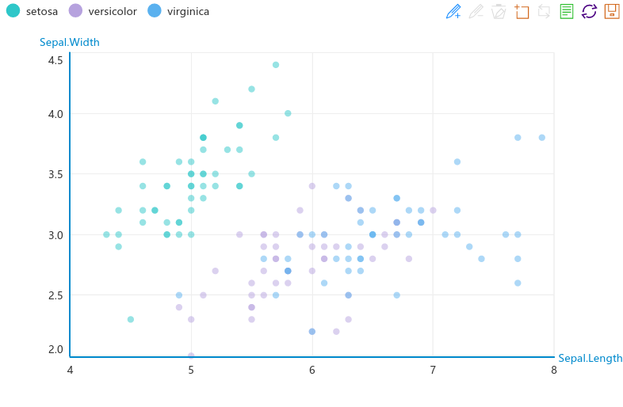

**I am currently upgrading the entire package. The functionalities are growing day to day.**
------------------------------

# An R Interface to Baidu Echarts2

[Echarts2](http://http://echarts.baidu.com/echarts2) is an open source d3-js library developed by Baidu Inc. for interactive charts. Compared to other popular d3-js libraries, Echarts is more Chinese-friendly. The latest stable release of Echart2 is  2.2.7. The most up-to-date version is Echart3. 

This package is to facilitate `R` users to make use of Echarts2 library (Echarts3 is not supported yet). A hello world example is as below:

```r
echartr(iris, Sepal.Length, Sepal.Width, Species) %>% setTheme('macarons')
```


> The initial `recharts` package was developed by Yang Zhou and Taiyun Wei. The current branch was forked from [Yihui Xie](https://github.com/yihui/recharts). 

# Installation

```r
if (!require(devtools)) install.packages('devtools')
library(devtools)
devtools::install_github('madlogos/recharts')
```

As the package is under development, you may come across errors when requiring the package directly from Github. You can alternatively download the codes from Github and compile the codes using RStudio.

# Documentation

- `R` help system
- [Official help](https://madlogos.github.io/recharts)

# Development

The package was developed using RStudio under Ubuntu 16. 

## Design

The Echarts object is an S3 list, comprising of the following elements:

(1) **Timeline contained**
- timeline
- options
    - series
        - list 1
        - ...
    - widgets (title, legend, toolbox, dataRange, dataZoom, roamController)

(2) **No timeline contained**
- series
    - list 1
    - ...
- widgets (title, legend, toolbox, dataRange, dataZoom, roamController)


The basic design is to configure an S3 object widget by widget and concatenate them by pipe operator (%>%). It is inspired by `ggplot2`.

The core function is `echartr`, which accepts basic settings of data source, variables, chart types and then constructs the framework of the S3 object (`options` part of the Echarts DOM object).

Then `echartr` parses the data source and calls series processing functions (`series_scatter`, `series_bar`, `series_line`, ...) to build the `series` part of the `options` object.

Then you can pass other widgets' configuration to the echarts object created by `echartr` to create/modify the widgets. E.g, `setTitle`, `setLegend`, `setToolbox`, `setDataZoom`, `setDataRange`, `setTimeline`, `setRoamController`, axes such as `setAxis`, `setPolar` and aesthetics such as `setGrid`, `setSymbols`, `setTooltip`, `setTheme`.

You can further tune the series configuration using series tuning functions (under development) with full APIs from Echarts.

Finally, you can use `addMarkLine` or `addMarkPoint` to modify the `series` object step further. 

## Status

### Achievements

- Major part of core function `echartr`
- Major part of widget functions `setTitle`, `setLegend`, `setDataRange`, `setDataZoom`, `setToolbox`, `setTimeline`
- Major part of Axis/grid functions `setAxis`, `setPolar`, `setGrid`
- Major part of aesthetic function `relocWidget`, `setTheme`, `setSymbols`, `setTooltip`
- Series processing fuenctions `series_scatter`, `series_bar`, `series_line`, `series_k`, `series_pie`, `series_funnel`, `series_radar`

### Supported chart types
- Cartesian coordnate system
    - [scatter|point|bubble](http://madlogos.github.io/recharts/Basic_Plots_01_Scatterplot.html)
    - [bar|hbar](http://madlogos.github.io/recharts/Basic_Plots_02_Bar.html#horizontal-bar-chart)
    - [bar_stack|hbar_stack|stacked_bar|stacked_hbar](http://madlogos.github.io/recharts/Basic_Plots_02_Bar.html#stacked-horizontal-bar-chart)
    - [vbar|column](http://madlogos.github.io/recharts/Basic_Plots_02_Bar.html#vertical-bar-column-chart)
    - [vbar_stack|column_stack|stacked_column|stacked_vbar](http://madlogos.github.io/recharts/Basic_Plots_02_Bar.html#stacked-vertical-bar-column-chart)
    - [histogram|hist|histogram_count|hist_count|histogram_freq|hist_freq](http://madlogos.github.io/recharts/Basic_Plots_02_Bar.html#histogram-chart-stat-by-freq)
    - [histogram_density|hist_density](http://madlogos.github.io/recharts/Basic_Plots_02_Bar.html#histogram-chart-stat-by-density)
    - [line](http://madlogos.github.io/recharts/Basic_Plots_03_Line.html#line-chart)
    - [line_stack|stacked_line](http://madlogos.github.io/recharts/Basic_Plots_03_Line.html#stacked-line-chart)
    - [line_smooth|smooth_line|curve](http://madlogos.github.io/recharts/Basic_Plots_03_Line.html#smooth-line-chart)
    - [line_smooth_stack|line_stack_smooth|stacked_smooth_line|curve_stack|stacked_curve](http://madlogos.github.io/recharts/Basic_Plots_03_Line.html#stacked-smooth-line-chart)
    - [area](http://madlogos.github.io/recharts/Basic_Plots_03_Line.html#area-chart)
    - [area_stack|stacked_area](http://madlogos.github.io/recharts/Basic_Plots_03_Line.html#stacked-area-chart)
    - [area_smooth|smooth_area](http://madlogos.github.io/recharts/Basic_Plots_03_Line.html#smooth-area-chart)
    - [area_smooth_stack|area_stack_smooth|stacked_smooth_area](http://madlogos.github.io/recharts/Basic_Plots_03_Line.html#stacked-smooth-area-chart)
    - [k|candlestick](http://madlogos.github.io/recharts/Basic_Plots_04_K.html)
    - pie
    - ring
    - ring_info
    - rose_radius
    - rose_area

## To-do

- Series processing functions `series_map`, `series_force`, `series_chord`, `series_gauge`, `series_wordCloud`, `series_tree`, `series_treemap`, `series_venn`, `series_riverEvent`, `series_heatmap`
- `addMarkLine`, `addMarkPoint`
- Tool functions to configure series precisely
- Bug fix
- Optimize algorithms

# License

Under the terms of [MIT](http://www.opensource.org/licenses/mit-license.php) + file license.
