# recharts

[](https://travis-ci.org/yihui/recharts)

# Intro 前言

本工具来源于百度开发的国内顶尖水平的开源`d3-js`可视项目[Echarts](http://echarts.baidu.com/)([Github Repo](https://github.com/ecomfe/echarts))。Yang Zhou和Taiyun Wei基于该工具开发了[recharts](https://github.com/taiyun/recharts)包，经Yihui Xie[修改](https://github.com/yihui/recharts)后，可通过`htmlwidgets`传递js参数，大大简化了开发难度。但此包开发仍未完成。为了赶紧上手用，基于该包做了一个函数`echartR`，用于制作基础Echart交互图。需要R版本>=3.2.0.

This tool originates from a top-tier `d3-js` visualization project of China: [Baidu Echarts](http://echarts.baidu.com/)([Github Repo](https://github.com/ecomfe/echarts)). Yang Zhou and Taiyun Wei developed an experimental R package [recharts](https://github.com/taiyun/recharts) based on it, which then evoluted into [yihui/recharts](https://github.com/yihui/recharts) by Yihui Xie to pass js parameters through `htmlwidgets`. The package is sill uder development. I developed a function `echartR` based on this package to make basic Echarts interation charts. This function requires R>=3.2.0.

`echartR`的主要工作是将Echarts参数封装成list，Yihui Xie的原型函数`echart`被用来处理这个list。`echart`函数的[基本用法](http://yihui.name/recharts)如下，除了数据本身，并没有提供其他参数的位置。

`echartR` majorly packs Echarts parameters into a list while `echart`, the prototype function developed by Yihui Xie, is used to parse the list. The [basic examples](http://yihui.name/recharts) of `echart` is as follows, which does not provide parameters entry other than dataset itself.

```r
if (! 'recharts' %in% installed.packages()[,1]){
    install.packages('recharts',
                     repos = c('http://yihui.name/xran', 'http://cran.rstudio.com')
                     )
}
library(recharts)
echart(iris, ~Sepal.Length, ~Sepal.Width)
```


```r
echart(iris, ~Sepal.Length, ~Sepal.Width, series = ~Species)
```


# Usage 用法
## Installation 安装
- 安装 Install `devtools` (`install.packages('devtools')`)
- 安装 Insall recharts (`install_github('yihui/recharts')`)
- 下载 Download `echartR.R`脚本文件到本地位置 script file to local disk:  [https://github.com/madlogos/recharts/blob/master/R/echartR.R](https://github.com/madlogos/recharts/blob/master/R/echartR.R))
- 调用 Source `echartR` 脚本 script (假设我将脚本放在本地 suppose I stored the script to local GitHub Repo: `source("~/Github/recharts/R/echartR.R")`)

## Grammar 语法

```
echartR(data, x=NULL, y, z=NULL, series=NULL, weight=NULL, 
        type="scatter", stack=FALSE,
        title=NULL, subtitle=NULL, title_pos=c('center','bottom'),
        symbolList=NULL, dataZoom=NULL, dataZoomRange=NULL,
        dataRange=NULL, splitNumber=NULL, dataRangePalette=NULL,
        xlab=NULL, ylab=NULL, xyflip=FALSE, AxisAtZero=TRUE, scale=TRUE,
        palette='aetnagreen', tooltip=TRUE, legend=TRUE,
        legend_pos=c('center','top'), 
        toolbox=TRUE, toolbox_pos=c('right','top'), 
        calculable=TRUE, asImage=FALSE))
```

- **data**: 数据集 dataset
- x: x变量，直方图可省略。x variable, only omitable for histograms。
- **y**: y变量 y variable
- z: z变量，只接受时间/日期变量，并打开时间轴。z variable, only accept data/time variable to open time axis
- series: Series(系列)变量 series variable
- weight: 权重变量，可用于直方图、气泡图等 weight variable, used in histogram, bubble, etc
- type: 默认 default `scatter`，可选 options 'scatter', 'bubble', 'bar', 'line', 'linesmooth', 'map', 'k', 'pie', 'ring', 'area', 'areasmooth', 'chord', 'force', 'tree', 'treemap', 'wordcloud', 'heatmap', 'histogram', 'funnel', 'pyramid', 'radar', 'radarfill'
    - 如选择map，则控制项必须写作一个长度为3的向量：c('map',`mapType`,`area/point`)。mapType可选'world'、'china'，或简体中文表示的具体中国地名。area/point为area时，用区块颜色表示效应大小；为point时，用点在地图上做标注。默认为c('map','china','area')。If `map` was chosen, the control option should be a vector of length 3: c('map',`mapType`,`area/point`). `mapType` could be either 'world' or 'china', of which simplified Chinese names are required for 'china'. When `area/point` equals to 'area', the function colors polygons to show the effects; while equals to 'point', it ticks droplets on the map.
- stack: 默认FALSE，是否堆积。用于制作堆积条图、柱图、线图和面积图等。Default to FALSE (do not stack). Used in stacked hbar/vbar, line and area chart, etc.
- title: 标题 
- subtitle: 副标题
- title_pos: 标题位置，可用c('left|center|right','top|center|bottom')，默认c("center","bottom")表示底部居中位置。Legend position which is a vector of length 2 (c('left|center|right','top|center|bottom')). Default to c('center','bottom') which means bottom meiddle.
- symbolList: 图形标志。可使用数组循环使用，如数组长度小于series水平数，则以最后一个标志填充。如设置为NULL或不设置，则循环显示Echarts默认的标志图形列表：c('circle','rectangle','triangle','diamond','emptyCircle','emptyRectangle','emptyTriangle','emptyDiamond')。也可任意指定'heart','droplet','pin','arrow','star5','star6'等非标图形。设为'none'则不显示。A vector assigning symbols. You can use an array of symbols. If the length of the symbols array is smaller than number of levels of the series, the last symbol will be used to extend the array. If you set symbolList NULL or leave it unset, the function circulates the default symbol list of Echarts: c('circle','rectangle','triangle','diamond','emptyCircle','emptyRectangle','emptyTriangle','emptyDiamond'). You can also assign non-standard symbols, such as 'heart','droplet','pin','arrow','star5','star6', 'star7', etc. When assigned to 'none', no symbols are shown.
- dataZoom: 数据缩放轴，默认FALSE. The axis to zoom data. Default to FALSE.
- dataZoomRange: 如`dataZoom=TRUE`，默认范围为0-100%。可用一个长度为2的向量控制初始范围，如`c(30,70)`显示初始30-70%。If `dataZoom=TRUE`, the default range is 0-100%. You can assign a vector with length of 2 to `dataZoomRange` to control the initial range. E.g.,`c(30,70)` means from 30% to 70% at the initial view.
- dataRange: 数据范围漫游范围，默认不打开。如要打开，设置dataRange=c(`高值标签`,`低值标签`) The range to zoom the data. Default to FALSE. Set dataRange=c(`High value label`,`Low value label`) to enable dataRange.
- splitNumber: 如打开数据漫游，可指定数据范围切分段数，默认为连续漫游轴(0)。在直方图里，如设定splitNumber，则将数据切分成splitNumber个块。When dataRange is on, assign splitNumber to cut the range into discrete sections. Default to 0 (continuous range). In histogram, if splitNumber is set, the y variable will be cut into splitNumber groups.
- dataRangePalette: 如打开数据漫游，可单独指定漫游色板(同palette功能)，否则采用Echarts默认值。You can independently assign palettes to dataRange (similar to overall palette). Default to NULL (applies echarts defaults).
- xlab: x轴标题 title of x-axis
- ylab: y轴标题 title of y-axis
- xyflip: 默认FALSE，是否翻转坐标轴。Flip x,y-axies. Default to FALSE.
- AxisAtZero: 默认FALSE，坐标轴是否交叉于零点。Axes cross at zero. Default to FALSE.
- scale: 默认TRUE，是否基于最大、最小值调整坐标尺度。Rescale the axes based on min and max values. Default to TRUE.
- palette: 默认aetnagreen，使用调色板。Overall palette. Default to 'aetnagreen'.
    - 种类 Palette names:
        - Aetna palettes: 可用 Including 'aetnagreen', 'aetnablue', 'aetnaviolet', 'aetnaorange', 'aetnateal', 'aetnacranberry'
        - RColorBrewer palettes: 可用 Including 'BrBG', 'PiYG', 'PRGn', 'PuOr', 'RdBu', 'RdGy', 'RdYlBu', 'RdYlGn', 'Spectral', 'Accent', 'Dark2', 'Paired', 'Pastel1', 'Pastel2', 'Set1', 'Set2', 'Set3', 'Blues', 'BuGn', 'BuPu', 'GnBu', 'Greens', 'Greys', 'Oranges', 'OrRd', 'PuBu', 'PuBuGn', 'PuRd', 'Purples', 'RdPu', 'Reds', 'YlGn', 'YlGnBu', 'YlOrBr', 'YlOrRd'
        - ggthemes palettes: 'calc', 'economist', 'economist_white', 'excel', 'few', 'fivethirtyeight', 'gdocs', 'pander', 'tableau', 'stata', 'tableau20', 'tableau10medium', 'tableaugray', 'tableauprgy', 'tableaublrd', 'tableaugnor', 'tableaucyclic', 'tableau10light', 'tableaublrd12','tableauprgy12', 'tableaugnor12','hc','darkunica', 'solarized','solarized_red', 'solarized_yellow', 'solarized_orange','solarized_magenta','solarized_violet', 'solarized_blue', 'solarized_cyan', 'solarized_green', 'wsj','colorblind', 'trafficlight'
        - 其他Other palettes: 'rainbow', 'terrain', 'topo', 'heat', 'cm'
    - 用法 Usage:
        - 可以不指定，使用函数默认。Do not set the value and function defaults will be loaded
        - 可以`palette=NULL`，使用Echarts默认。Set `palette=NULL` to use Echarts defaults
        - 可以`palette=palette name`指定上述任何一种色板。Set `palette=palette name` to assign any palette listed above
        - 规定色板的同时跟个数限定，限定色板颜色的个数，如`palette='calc(3)'`，会从calc色板中**随机**取3种颜色。Set `palette=palette name(number)` to restrict number of colors within the palette (e.g., `palette='calc(3)'` picks 3 colors out of 'calc' **RANDOMLY**)
        - 可以`palette=c(color1,color2,color3,...)`自定义色板向量，向量可以是颜色名，也可以是Hex表达式。可以用`colors()`函数查看所有支持的颜色名称，`demo(colors)`查看颜色效果。Set `palette=c(color1,color2,color3,...)` to define a palette vector, made of which either color names or Hex expressions. Use `colors()` to check available color names and check the effects using `demo(colors)`.
- tooltip: 默认TRUE，鼠标指针特效。Mouse tip effects swtich. Default to TRUE.
- legend: 默认TRUE，是否显示图例。Whether show the legend. Default to TRUE.
- legend_pos: 图例位置，长度为2的向量，设置方法参考`title_pos`。Legend position, a vector of length 2. Refer to `title_pos` for configuration.
- toolbox: 默认TRUE，是否显示工具箱。Echarts Tool box switch. Default to TRUE.
- toolbox_pos: 工具箱位置，默认右上方。参考`title_pos`的设置方法。Toolbox position, default to c('right','top'). Refer to `title_pos` for configuration.
- calculable: 默认TRUE，是否支持拖曳重算(Echarts专利) Calculable switch (Echarts patent).
- asImage: 默认FALSE，是否出静态图。renderAsImage switch.Deafult to FALSE.

# Examples 示例

**GitHub上只能放静态图，真实`d3-js`效果图请点击[这个链接](http://pan.baidu.com/s/1o6pDTf8)**

```r
Sys.setlocale("LC_CTYPE","Chs")
source("~/Github/recharts/R/echartR.R")
#source("C:/HMSProjects/Data Analytics/R_scripts/CommonFunctions.R")
knitr::opts_chunk$set(message=FALSE,warning=FALSE,results='asis')
```

## Scatter 散点图

### Singular-series Scatter 单系列散点图


```r
echartR(data = iris, x = ~Sepal.Width, y = ~Petal.Width, 
        type = 'scatter', palette='solarized_magenta',
        title = 'Scatter - Sepal Width vs Petal Width (iris)', 
        xlab = 'Sepal Width', ylab = 'Petal Width')
```


### Multi-series Scatter 多系列散点图

指定series，且显示范围从零点开始(`scale=FALSE`)


```r
echartR(data = iris, x = ~Sepal.Width, y = ~Petal.Width, series = ~Species,
        type = 'scatter', palette='aetnaviolet', symbolList='circle', scale=F,
        title = 'Scatter - Sepal Width vs Petal Width, by Species (iris)',
        xlab = 'Sepal Width', ylab = 'Petal Width')
```

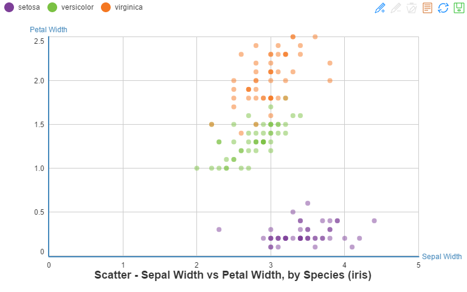

使用三套非标准图形(箭头、心形、八角星)区分数据系列


```r
echartR(data = iris, x = ~Sepal.Width, y = ~Petal.Width, series = ~Species,
        type = 'scatter', palette='aetnateal',
        symbolList=c('arrow','heart','star8'),
        title = 'Scatter - Sepal Width vs Petal Width, by Species (iris)',
        xlab = 'Sepal Width', ylab = 'Petal Width')
```

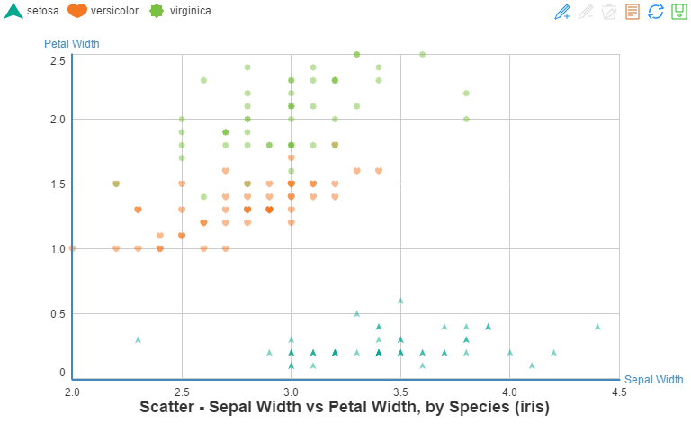

## Bubble 气泡图

气泡图同样来源于散点图。type改为`bubble`即可，如不指定`weight`变量，函数默认指定y为气泡权重。

### Singular-series Bubble 单系列气泡图


```r
echartR(data = iris, x = ~Sepal.Width, y = ~Petal.Width, 
        weight = ~Petal.Length,
        type = 'bubble', palette='solarized_cyan',
        title = paste("Bubble - Sepal Width vs Petal Width,",
                      "weighed by Petal Length (iris)"),
        xlab = 'Sepal Width', ylab = 'Petal Width')
```


### Multi-series Bubble 多系列气泡图

用`symbolList=c('circle','emptyCircle')`设置第1个数据系列为实心圆、剩下的数据系列以空心圆作为标志图形。palette设置为tableauGnOr(3)，只随机取该色板的3种颜色。


```r
echartR(data = iris, x = ~Sepal.Width, y = ~Petal.Width, 
        weight = ~Petal.Length, series = ~Species, 
        symbolList=c('emptyCircle','circle'),
        type = 'bubble', palette='tableaugnor(3)',
        title = paste('Bubble - Sepal Width vs Petal Width, by Species,',
                      'weighed by Petal Length (iris)'), 
        xlab = 'Sepal Width', ylab = 'Petal Width')
```

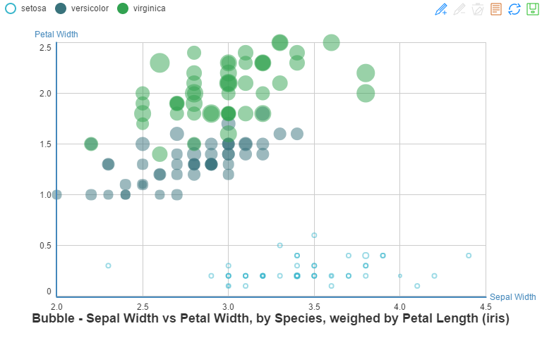

## Column 柱图

先生成一个汇总数据集`dtiris`。


```r
library(reshape2)
dfiris <- iris
dfiris$id <- row.names(iris)
dfiris <- melt(dfiris,id=c("Species","id"))
names(dfiris) <- c("Species","id","Param","Value")
dtiris <- dcast(dfiris[,c(1,3,4)],Species+Param~.,value.var="Value",mean)
names(dtiris) <- c("Species","Param","Mean")
knitr::kable(dcast(dtiris,Param~Species,sum,value.var="Mean"),
             format='html',caption="Table: Mean of parameters (iris)")
```

<table>
<caption>Table: Mean of parameters (iris)</caption>
 <thead>
  <tr>
   <th style="text-align:left;"> Param </th>
   <th style="text-align:right;"> setosa </th>
   <th style="text-align:right;"> versicolor </th>
   <th style="text-align:right;"> virginica </th>
  </tr>
 </thead>
<tbody>
  <tr>
   <td style="text-align:left;"> Sepal.Length </td>
   <td style="text-align:right;"> 5.006 </td>
   <td style="text-align:right;"> 5.936 </td>
   <td style="text-align:right;"> 6.588 </td>
  </tr>
  <tr>
   <td style="text-align:left;"> Sepal.Width </td>
   <td style="text-align:right;"> 3.428 </td>
   <td style="text-align:right;"> 2.770 </td>
   <td style="text-align:right;"> 2.974 </td>
  </tr>
  <tr>
   <td style="text-align:left;"> Petal.Length </td>
   <td style="text-align:right;"> 1.462 </td>
   <td style="text-align:right;"> 4.260 </td>
   <td style="text-align:right;"> 5.552 </td>
  </tr>
  <tr>
   <td style="text-align:left;"> Petal.Width </td>
   <td style="text-align:right;"> 0.246 </td>
   <td style="text-align:right;"> 1.326 </td>
   <td style="text-align:right;"> 2.026 </td>
  </tr>
</tbody>
</table>

### Tiled Column 平铺柱图


```r
echartR(data = dtiris, x = ~Param, y = ~Mean,  series = ~Species,
        type = 'bar', palette='fivethirtyeight',
        title = paste("VBar - Parameter Mean by Species", "(iris)"), 
        xlab = 'Parameter', ylab = 'Mean', legend_pos=c('right','center'))
```

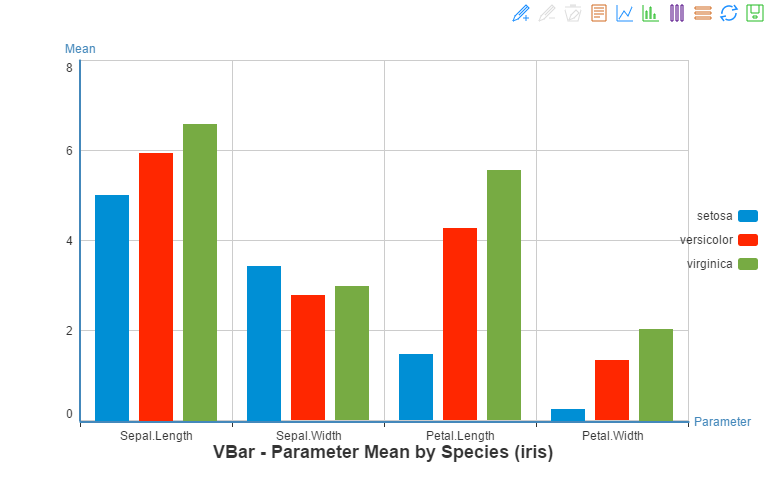

### Stacked Column 堆积柱图


```r
echartR(data = dtiris, x = ~Param, y = ~Mean, 
        series = ~Species, stack=T,
        type = 'bar', palette='pander',
        title = paste("VBar - Parameter Mean by Species", "(iris)"), 
        xlab = 'Parameter', ylab = 'Mean', legend_pos=c('right','center'))
```

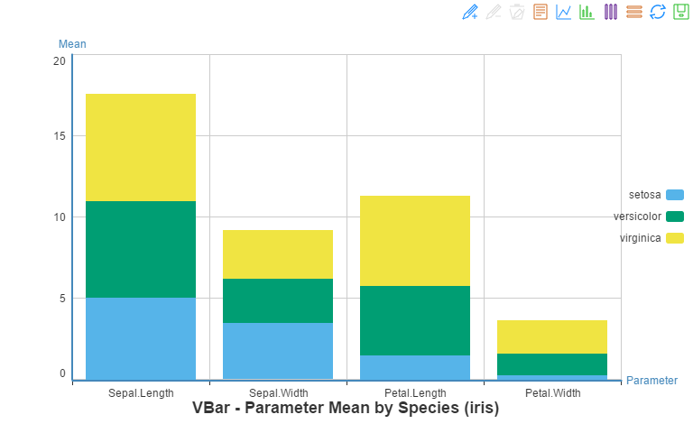

堆积与否，也可以简单地通过工具栏的`平铺`和`堆积`按钮切换。非常强大(但也得在函数配置项里正确地码出代码)。

## Bar 条图

条图和柱图的区别只在于`xyflip`开关选项。

### Tiled Bar 平铺条图


```r
echartR(data = dtiris, x = ~Species, y = ~Mean, series = ~Param, 
        type = 'bar', palette='stata', xyflip=T,
        title = 'Species-specific Mean by Parameters (iris)', 
        xlab = 'Species', ylab = 'Mean', legend_pos=c('right','center'))
```


### Stacked Bar 堆积条图

palette设为calc的随机4种颜色。打开stack (`stack=TRUE`)。


```r
echartR(data = dtiris, x = ~Param, y = ~Mean, 
        series = ~Species, stack=T, xyflip=T,
        type = 'bar', palette='calc',
        title = 'Parameter Mean by Species (iris)', 
        xlab = 'Parameter', ylab = 'Mean', legend_pos=c('right','center'))
```


## Histogram 直方图

直方图是柱图的一种特例，只需要指定y变量。可通过`splitNumber`指定直方数(默认9)。`xyflip`设为TRUE则成为等价的横条图。

> Echarts规定柱/条图和散点图的自变量轴均为category类型，因此暂时无法简单地做出传统外观的直方图。


```r
echartR(airquality, y=~Temp, type='histogram', splitNumber=13,
        palette='pastel2', title='Histogram of temperature (airquality)')
```


## Pie 饼图

用`mtcars`作为作图数据集。


```r
dtcars <- mtcars
dtcars$car <- row.names(dtcars)
dtcars$transmission <- as.factor(dtcars$am)
levels(dtcars$transmission) <- c("Automatic","Manual")
dtcars$cylinder <- as.factor(dtcars$cyl)
dtcars$carburetor <-as.factor(dtcars$carb)
```


```r
echartR(dtcars, x = ~transmission,  y = ~car, type='pie',
        palette='darkunica', 
        title='Number of cars by transmission (mtcars)')
```

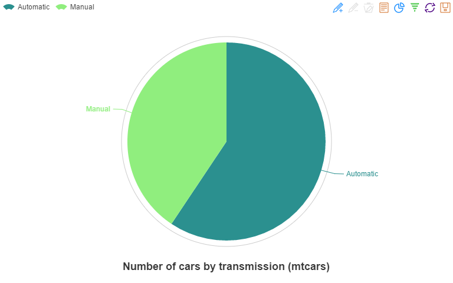

## Ring 环图

环形图是饼图的变形，只需将`type`改为'ring'。Echarts中只需要把饼图的半径参数扩展为包含内、外径的长度为2的向量即可。


```r
echartR(dtcars, x = ~cylinder,  y = ~car, type='ring',
        palette='hc', title='Number of Cylinders (mtcars)')
```

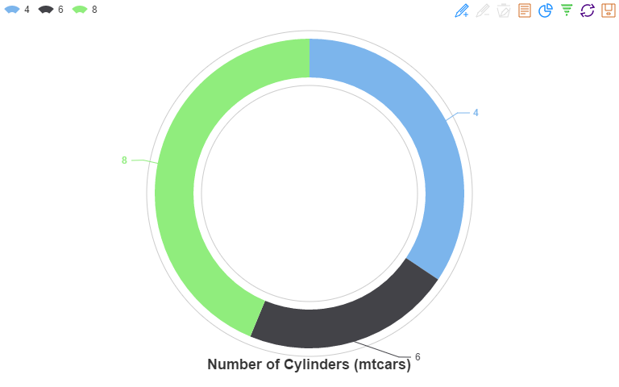

## Line 线图

### Unstacked Line 平铺线图

打开数据缩放`dataZoom=T`


```r
data(airquality)
airquality$Date <- strptime(paste(2015,airquality$Month,airquality$Day,sep="-")
                            ,format="%Y-%m-%d")
airquality$strDate <- with(airquality,paste(2015,Month,Day,sep="-"))
airquality$TempG <- cut(airquality$Temp,breaks=c(0,60,70,80,100))
echartR(airquality, x = ~Day, y= ~Wind, series=~Month,
          type='line', dataZoom=T, dataZoomRange=c(30,70),
        palette='tableauBlRd', xlab = 'Days', ylab = 'Wind',
        title='Day-specific Wind by month (airquality)', symbolList='none')
```


线段平滑(`type='linesmooth'`)，不显示标志图形(`symbolList='none'`)。Echarts对缺失值默认不填补，因此有很多断线。需要在数据前处理时自行作插值运算。


```r
airq <- melt(airquality[,c("Ozone","Solar.R","Wind","Temp","strDate")],
             id=c("strDate"))
echartR(airq, x = ~strDate, y= ~value, series= ~variable, type='linesmooth',
        symbolList='none', dataZoom=T, dataZoomRange=c(20,50),
        palette='tableauPrGy', xlab = 'Date', ylab = 'Measure',
        title='Climate measures by day (airquality)')
```


### Stacked Line 堆积线图

```r
echartR(dfiris, x = ~id, y= ~Value, series= ~Param, type='line',stack=T,
        palette='tableauBlRd12', xlab = 'Sample ID', ylab = 'Measure',
        title='Parameter measures (iris)')
```

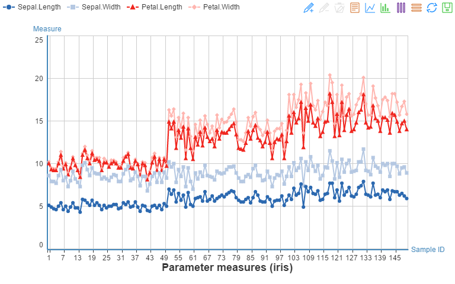

线段平滑，不显示标志图形

```r
echartR(dfiris, x = ~id, y= ~Value, series= ~Param, type='linesmooth',stack=T,
        palette='tableauGnOr12', xlab = 'Sample ID', ylab = 'Measure',
        symbolList='none',
        title='Parameter measures (iris)')
```


## Area 面积图
Echarts中，面积图本质上被定义为线图，只需通过`itemStyle`参数渲染颜色。

### Tiled Area 平铺面积图

```r
echartR(dfiris, x = ~id, y= ~Value, series= ~Param, type='area',
        palette='brbg', xlab = 'Sample ID', ylab = 'Measure',
        symbolList='emptyDiamond',title='Parameter measures (iris)')
```


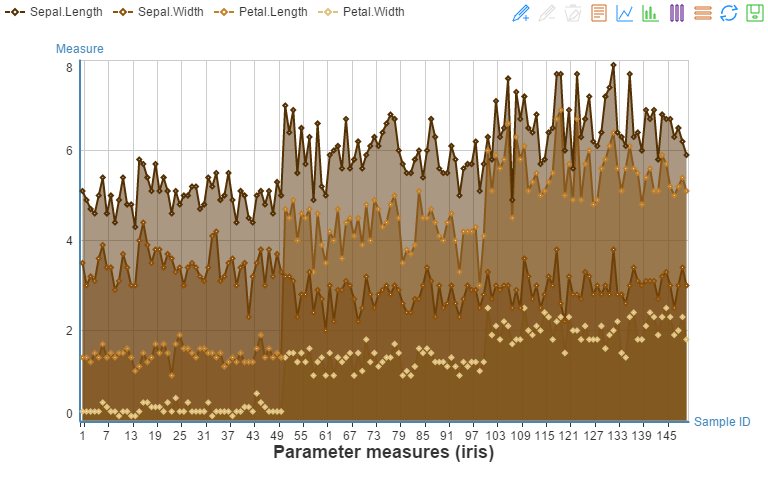

线段平滑`type='areasmooth'`，并打开数据缩放`dataZoom=TRUE`，初始显示40%-80%。

```r
echartR(dfiris, x = ~id, y= ~Value, series= ~Param, type='areasmooth',
        palette='PiYG', xlab = 'Sample ID', ylab = 'Measure', 
        symbolList='none', dataZoom=T, dataZoomRange=c(40,80),
        title='Parameter measures (iris)')
```


### Stacked Area 堆积面积图

```r
echartR(dfiris, x = ~id, y= ~Value, series= ~Param, type='area',stack=T,
        palette='PRGn', xlab = 'Sample ID', ylab = 'Measure',
        symbolList='emptyCircle',
        title='Parameter measures (iris)')
```

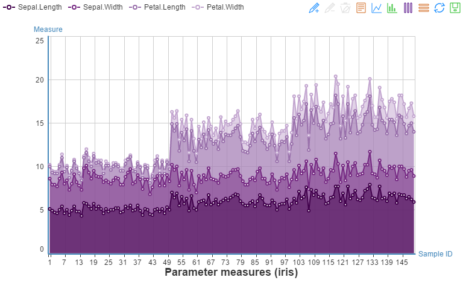

线段平滑(`type='areasmooth'`)。自定义色板向量。

```r
echartR(dfiris, x = ~id, y= ~Value, series= ~Param, type='areasmooth',stack=T,
        palette=c('red','yellow','limegreen','skyblue'), 
        xlab = 'Sample ID', ylab = 'Measure', 
        symbolList='none',
        title='Parameter measures (iris)')
```


## Funnel 漏斗图

### Funnel 普通漏斗图


```r
echartR(dtcars, x = ~carburetor,  y = ~car, type='funnel',
        palette='RdBu', title='Number of carburetors of cars (mtcars)')
```

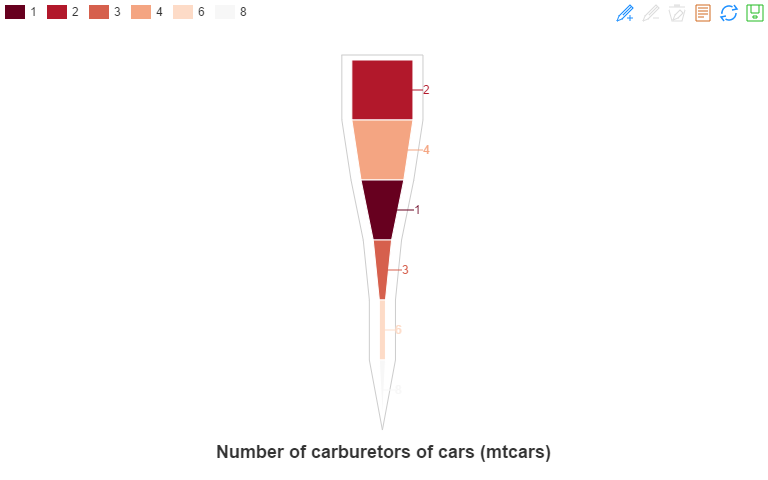

### Pyramid 金字塔图
金字塔图即逆序漏斗图。


```r
echartR(dtcars, x = ~carburetor,  y = ~car, type='pyramid',
        palette='RdGy', title='Number of carburetors of cars (mtcars)')
```


## Radar 雷达图

雷达图就是极坐标系下的线图/面积图，通过Echarts的`polar`参数模块控制。

```r
player <- data.frame(name=c(rep("Philipp Lahm",8),rep("Dani Alves",8)),
                     para=rep(c("Passing%","Key passing","Comp crosses",
                                "Crossing%","Successful dribbles",
                                "Dispossessed","Dribbled past","Fouls"),2),
                     value=c(89.67, 1.51, 0.97, 24.32, 0.83, 0.86, 1.15, 0.47,
                            86.62, 2.11, 0.99, 20.78, 1.58, 1.64, 0.9, 1.71))
```

### Hollow Radar 空心雷达


```r
echartR(player, x= ~para, y= ~value, series= ~name, type='radar',
        symbolList='none', palette=c('red','blue'),
        title='Lahm vs Alves (by @mixedknuts)')
```


### Solid Radar 实心雷达


```r
echartR(player, x= ~para, y= ~value, series= ~name, type='radarfill',
        symbolList='none', palette=c('firebrick1','dodgerblue'),
        title='Lahm vs Alves (by @mixedknuts)')
```


## Map 地图

R和Rstudio的中文转码在Windows里一直是老大难。在本文档，Rstudio的默认编码采用CP936编码，文档用UTF-8。如直接在程序内读数据集，用iconv转码后，落单的汉字仍然会显示为乱码。可先下载[ChinaGDP.txt](https://raw.githubusercontent.com/madlogos/Shared_Doc/master/Shared_Documents/ChinaGDP.txt)到本地，`readLines`读入。


```r
#gdp <- readLines("https://raw.githubusercontent.com/madlogos/Shared_Doc/master/Shared_Documents/ChinaGDP.txt")
gdp <- readLines("ChinaGDP.txt")
dtgdp <- unlist(strsplit(gdp,split=","))
dtgdp <- as.data.frame(t(matrix(dtgdp,nrow=3)),stringsAsFactors=F)
names(dtgdp) <- c('Year','Prov',"GDP")
dtgdp$GDP <- as.numeric(dtgdp$GDP) 
knitr::kable(dcast(dtgdp,Prov~Year,sum,value.var="GDP"), format='html',
         caption="Table: 2012-2014 GDP of Provinces in China (Million USD)")
```

<table>
<caption>Table: 2012-2014 GDP of Provinces in China (Million USD)</caption>
 <thead>
  <tr>
   <th style="text-align:left;"> Prov </th>
   <th style="text-align:right;"> 2012 </th>
   <th style="text-align:right;"> 2013 </th>
   <th style="text-align:right;"> 2014 </th>
  </tr>
 </thead>
<tbody>
  <tr>
   <td style="text-align:left;"> 安徽 </td>
   <td style="text-align:right;"> 272666 </td>
   <td style="text-align:right;"> 307416 </td>
   <td style="text-align:right;"> 339401 </td>
  </tr>
  <tr>
   <td style="text-align:left;"> 北京 </td>
   <td style="text-align:right;"> 283238 </td>
   <td style="text-align:right;"> 314871 </td>
   <td style="text-align:right;"> 347249 </td>
  </tr>
  <tr>
   <td style="text-align:left;"> 福建 </td>
   <td style="text-align:right;"> 312107 </td>
   <td style="text-align:right;"> 351347 </td>
   <td style="text-align:right;"> 391609 </td>
  </tr>
  <tr>
   <td style="text-align:left;"> 甘肃 </td>
   <td style="text-align:right;"> 89508 </td>
   <td style="text-align:right;"> 101208 </td>
   <td style="text-align:right;"> 111273 </td>
  </tr>
  <tr>
   <td style="text-align:left;"> 广东 </td>
   <td style="text-align:right;"> 904046 </td>
   <td style="text-align:right;"> 1003746 </td>
   <td style="text-align:right;"> 1103605 </td>
  </tr>
  <tr>
   <td style="text-align:left;"> 广西 </td>
   <td style="text-align:right;"> 206497 </td>
   <td style="text-align:right;"> 232158 </td>
   <td style="text-align:right;"> 255144 </td>
  </tr>
  <tr>
   <td style="text-align:left;"> 贵州 </td>
   <td style="text-align:right;"> 108550 </td>
   <td style="text-align:right;"> 129284 </td>
   <td style="text-align:right;"> 150599 </td>
  </tr>
  <tr>
   <td style="text-align:left;"> 海南 </td>
   <td style="text-align:right;"> 45236 </td>
   <td style="text-align:right;"> 50805 </td>
   <td style="text-align:right;"> 56989 </td>
  </tr>
  <tr>
   <td style="text-align:left;"> 河北 </td>
   <td style="text-align:right;"> 420990 </td>
   <td style="text-align:right;"> 456976 </td>
   <td style="text-align:right;"> 478953 </td>
  </tr>
  <tr>
   <td style="text-align:left;"> 河南 </td>
   <td style="text-align:right;"> 468900 </td>
   <td style="text-align:right;"> 519212 </td>
   <td style="text-align:right;"> 568786 </td>
  </tr>
  <tr>
   <td style="text-align:left;"> 黑龙江 </td>
   <td style="text-align:right;"> 216896 </td>
   <td style="text-align:right;"> 232237 </td>
   <td style="text-align:right;"> 244829 </td>
  </tr>
  <tr>
   <td style="text-align:left;"> 湖北 </td>
   <td style="text-align:right;"> 352482 </td>
   <td style="text-align:right;"> 398316 </td>
   <td style="text-align:right;"> 445514 </td>
  </tr>
  <tr>
   <td style="text-align:left;"> 湖南 </td>
   <td style="text-align:right;"> 350958 </td>
   <td style="text-align:right;"> 395622 </td>
   <td style="text-align:right;"> 440328 </td>
  </tr>
  <tr>
   <td style="text-align:left;"> 吉林 </td>
   <td style="text-align:right;"> 189136 </td>
   <td style="text-align:right;"> 209608 </td>
   <td style="text-align:right;"> 224715 </td>
  </tr>
  <tr>
   <td style="text-align:left;"> 江苏 </td>
   <td style="text-align:right;"> 856368 </td>
   <td style="text-align:right;"> 955269 </td>
   <td style="text-align:right;"> 1059587 </td>
  </tr>
  <tr>
   <td style="text-align:left;"> 江西 </td>
   <td style="text-align:right;"> 205131 </td>
   <td style="text-align:right;"> 231520 </td>
   <td style="text-align:right;"> 255724 </td>
  </tr>
  <tr>
   <td style="text-align:left;"> 辽宁 </td>
   <td style="text-align:right;"> 393607 </td>
   <td style="text-align:right;"> 437216 </td>
   <td style="text-align:right;"> 466018 </td>
  </tr>
  <tr>
   <td style="text-align:left;"> 内蒙古 </td>
   <td style="text-align:right;"> 251574 </td>
   <td style="text-align:right;"> 271788 </td>
   <td style="text-align:right;"> 289274 </td>
  </tr>
  <tr>
   <td style="text-align:left;"> 宁夏 </td>
   <td style="text-align:right;"> 37090 </td>
   <td style="text-align:right;"> 41417 </td>
   <td style="text-align:right;"> 44802 </td>
  </tr>
  <tr>
   <td style="text-align:left;"> 青海 </td>
   <td style="text-align:right;"> 29997 </td>
   <td style="text-align:right;"> 33925 </td>
   <td style="text-align:right;"> 37460 </td>
  </tr>
  <tr>
   <td style="text-align:left;"> 山东 </td>
   <td style="text-align:right;"> 792289 </td>
   <td style="text-align:right;"> 882974 </td>
   <td style="text-align:right;"> 967419 </td>
  </tr>
  <tr>
   <td style="text-align:left;"> 山西 </td>
   <td style="text-align:right;"> 191886 </td>
   <td style="text-align:right;"> 203485 </td>
   <td style="text-align:right;"> 207714 </td>
  </tr>
  <tr>
   <td style="text-align:left;"> 陕西 </td>
   <td style="text-align:right;"> 228969 </td>
   <td style="text-align:right;"> 259078 </td>
   <td style="text-align:right;"> 287978 </td>
  </tr>
  <tr>
   <td style="text-align:left;"> 上海 </td>
   <td style="text-align:right;"> 319710 </td>
   <td style="text-align:right;"> 348804 </td>
   <td style="text-align:right;"> 383554 </td>
  </tr>
  <tr>
   <td style="text-align:left;"> 四川 </td>
   <td style="text-align:right;"> 378183 </td>
   <td style="text-align:right;"> 424026 </td>
   <td style="text-align:right;"> 464555 </td>
  </tr>
  <tr>
   <td style="text-align:left;"> 天津 </td>
   <td style="text-align:right;"> 204259 </td>
   <td style="text-align:right;"> 232031 </td>
   <td style="text-align:right;"> 255950 </td>
  </tr>
  <tr>
   <td style="text-align:left;"> 西藏 </td>
   <td style="text-align:right;"> 11105 </td>
   <td style="text-align:right;"> 13041 </td>
   <td style="text-align:right;"> 14990 </td>
  </tr>
  <tr>
   <td style="text-align:left;"> 新疆 </td>
   <td style="text-align:right;"> 118896 </td>
   <td style="text-align:right;"> 134991 </td>
   <td style="text-align:right;"> 150812 </td>
  </tr>
  <tr>
   <td style="text-align:left;"> 云南 </td>
   <td style="text-align:right;"> 163318 </td>
   <td style="text-align:right;"> 189255 </td>
   <td style="text-align:right;"> 208612 </td>
  </tr>
  <tr>
   <td style="text-align:left;"> 浙江 </td>
   <td style="text-align:right;"> 549154 </td>
   <td style="text-align:right;"> 606609 </td>
   <td style="text-align:right;"> 653668 </td>
  </tr>
  <tr>
   <td style="text-align:left;"> 重庆 </td>
   <td style="text-align:right;"> 180746 </td>
   <td style="text-align:right;"> 204364 </td>
   <td style="text-align:right;"> 232230 </td>
  </tr>
</tbody>
</table>

```r
dtgdp$Prov <- as.factor(enc2native(dtgdp$Prov))
dtgdp$Year<- as.factor(dtgdp$Year)
```

### Area 区块标注

开启数据漫游，并定义色板。


```r
echartR(dtgdp, x = ~Prov, y = ~GDP, series= ~Year, 
        type=c('map','china','area'), palette='gdocs',
        title="GDPs of China Provinces, 2012-2014 (Million USD)",
        dataRangePalette=c('red','orange','yellow','green','limegreen'),
        dataRange=c('High',"Low"),toolbox_pos=c('right','center'))
```


用世界GDP前20粗糙演示世界地图。漫游轴切分为10档(`splitNumber=10`)。


```r
worldgdp <- data.frame(
    country=c('United States of America','China','Japan','Germany',
              'United Kingdom','France','Brazil', 'Italy','India','Russia',
              'Canada','Australia','South Korea','Spain','Mexico','Indonesia',
             'Netherlands','Turkey','Saudi Arabia','Switzerland'),
    GDP=c(17418925,10380380,4616335,3859547,2945146,2846889,2353025,2147952,
          2049501,1857461,1788717,1444189,1416949,1406855,1282725,888648,866354,
          806108,752459,712050))
echartR(worldgdp, x = ~country, y = ~GDP, type=c('map','world','area'),
        title="Nations with top 20 GDPs, 2014 (Million USD) - Wikipedia",
        dataRangePalette='rainbow(5)', dataRange=c("High","Low"), 
        splitNumber=10, toolbox_pos=c('right','center'))
```


### Point 点标注


## Chord 和弦图


## Force 力导向布局图

# Recognized Issues 已知的问题

1. `echartR`比较接近于`lattice`，而不是`ggplot2`图层叠加的思路。每次使用都要一次性编辑很多参数；
1. 函数本身写得比较笨重，技术还不行；
1. 未实现的功能：
    1. Force，Chord，Wordcloud，candlestick(k)和点标注地图还没有开发；
    1. 仍然不支持时间格式的坐标轴（series中数据格式有问题）；
    1. 仍然不支持动态时间轴；
    1. tooltip不够智能；
    1. 进阶功能（包括多图联动、双坐标轴等）仍未开发；
1. **注意**：如要改进，千万不要在函数代码中`set.seed()`，这会全局锁定种子数，导致knitr时每做一图都按该种子随机化`htmlwidget id`。最终的文档中，某些图会无法按指定代码出图，而是重复其他的图（串id）。